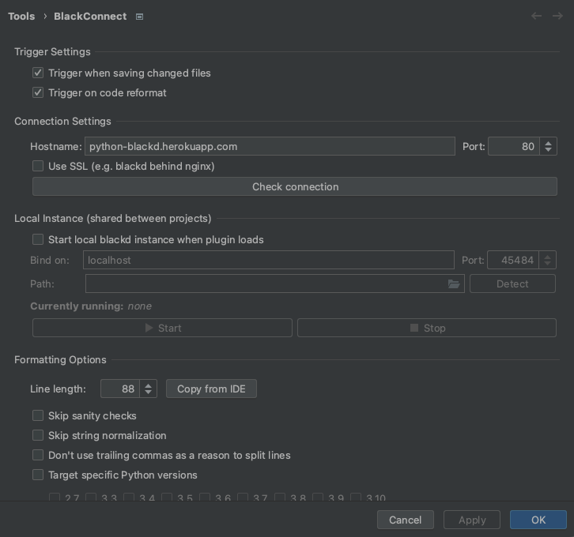

# Python blackD

Python black formatting code in heroku

You can also free use for your local development
please add this host to your black config

## Sample using pycharm


```shell
    Host: python-blackd.herokuapp.com
    Port: 80
```

## change remote url
```shell
  heroku git:remote -a python-blackd
```

## When update deployment
```shell
  heroku container:push web && heroku container:release web
```